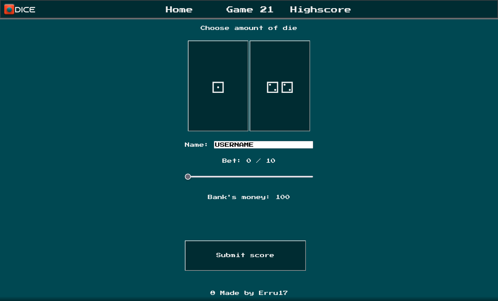

<!-- Update to proj -->
# Travis CI:  

  

# Scrutinizer CI:  

  

  

# How to open

You can use a program like Xampp to run the website locally.  
Run Apache on Xampp
Locate xampp/htdocs (Default C:/xampp/htdocs)
Put proj folder into htdocs (xampp/htdocs/proj)
In a web browser, go to the link [localhost/proj/public](localhost/proj/public)

# How to play

Navigate to Game 21  
Enter your name (used for highscores)  
Choose to bet (can be kept at 0)  
Choose to play with either one or two dices  
Try to get as close to 21 without busting  
When you feel happy you may submit your score (this resets your money)  
Check out your score on the Highscore page and see statistics.

# Purpose

This webpage has been made as a [school project](https://dbwebb.se/kurser/mvc-v1/kmom10)  
It is completely made with PHP, HTML and CSS with Laravel as framework and SQLite as database. As ORM I chose Laravel's built-in Eloquent.
Logo and favicon was created using Illustrator and PhotoShop.
